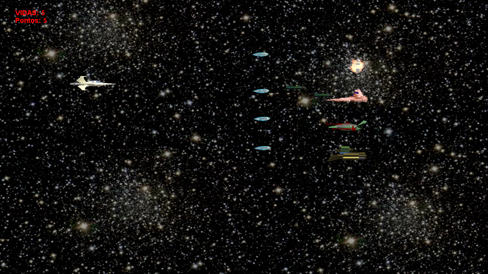

# _DinaBodic

DinaBodic is a 2D starship platform game written in Java.

For more information, read the report about the game:



# Running

Download the "DinaBodic.zip" file and inside the "DinaBodic" folder, run:

```
java -jar DinaBodic.jar
```

# Author

Graphics were created by Samir Piccolotto Issa, VFX and sound
by Felipe Ridolfi. Code was created by Rafael Diniz.

